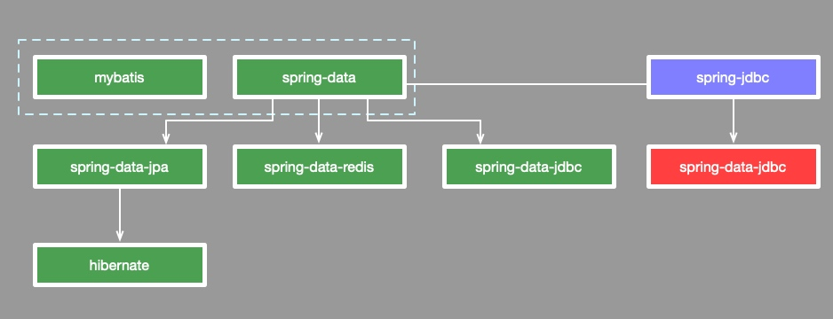
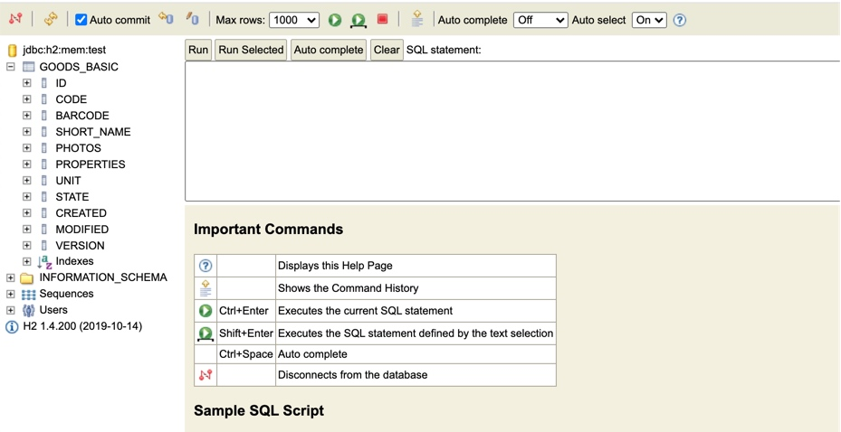
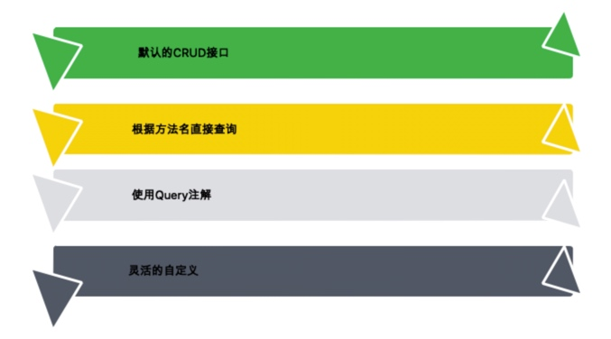
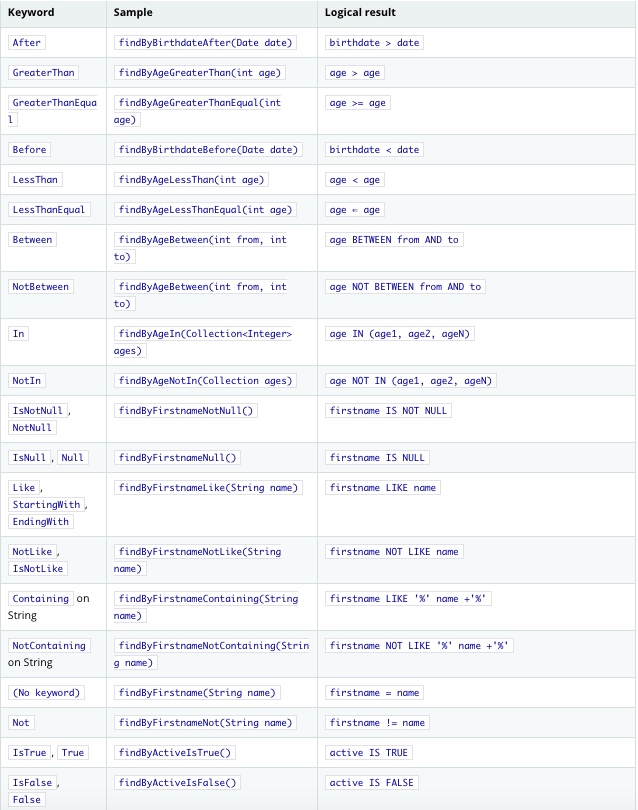

# spring-data-jdbc最佳实践，注意不是spring-jdbc

>原创：猿逻辑，欢迎分享，转载请保留出处。跟着小q学Java，最快的进阶方式。

本文的完整示例代码，见github仓库。小q只在文中介绍最关键的代码块。

```bash
https://github.com/yuanluoji/purestart-springboot-data-jdbc
```

很多人知道Mybatis，知道Jpa，但对2019年新诞生的一门技术知之甚少。那就是：`spring-data-jdbc`。这个标题起的很普通，但是内容绝对是最新的。

注意我们这里说的是`data-jdbc`，而不是普通的`jdbc`。它拥有了类似`jpa`的一些特性，比如能够根据方法名推导出sql，基本的CRUD等，也拥有了写原生sql的能力。

最为关键的是，它非常的清爽，不需要依赖hibernte或者jpa。

千呼万唤始出来，使用了一下，真是惊艳。它们的关系可以看下面这张图。



可以看到spring-data-jdbc是和spring-data-jpa一样，同属于spring-data系列的。下面我们就来实践一把，来看一下它的最佳实践。

## 1. 配置准备工作

创建好Springboot项目之后，需要加入spring-data-jdbc的依赖。

```xml
<dependency>
	<groupId>org.springframework.boot</groupId>
	<artifactId>spring-boot-starter-data-jdbc</artifactId>
</dependency>
```

为了方便演示，我这里使用的是h2数据库。可以在springboot中配置开启它的web配置端。

```yaml
  h2:
    console:
      enable: true
      path: /h2-console
      settings:
        trace: true
        web-allow-others: true
```

启动之后，就可以通过下面的地址访问h2的console。


可以看到里面有一张叫做goods_basic的表。它是怎么创建进去的呢？先来看一下我们的datasource配置。

```yaml
spring:
  datasource:
    driver-class-name: org.h2.Driver
    url: jdbc:h2:mem:test;MODE=MYSQL;CASE_INSENSITIVE_IDENTIFIERS=TRUE;
    schema: classpath:sql/h2/schema.sql
    #data: classpath:sql/h2/data.sql
```

其中， spring.datasource.schema所指定的sql文件，将会在项目启动的时候，自动执行，这当然也是有`AutoConfigure`来完成的。来看一下我们的建表语句。

```sql
CREATE TABLE `goods_basic` (
  `id` int unsigned NOT NULL AUTO_INCREMENT,
  `code` varchar(255) NOT NULL DEFAULT '' COMMENT '编码，不可重复；',
  `barcode` varchar(255) NOT NULL COMMENT '69开头的13位标准码',
  `short_name` varchar(255)  NOT NULL COMMENT '商品名称',
  `photos` json DEFAULT NULL COMMENT '商品图片',
  `properties` json NOT NULL COMMENT '商品属性，或者规格',
  `unit` varchar(8)  NOT NULL COMMENT '单位;最多8个字节',
  `state` tinyint NOT NULL DEFAULT '1',
  `created` datetime NOT NULL COMMENT '创建时间',
  `modified` datetime NOT NULL COMMENT '更新时间',
  `version` bigint NOT NULL DEFAULT '0' COMMENT '乐观锁版本号',
  PRIMARY KEY (`id`),
  UNIQUE KEY `idx_account_role` (`code`,`barcode`) USING BTREE
) ;
```

可以看到是彻头彻尾的mysql语法。通过在h2里面指定`MODE=MYSQL`属性，就可以把h2切换到mysql的语法。虽然h2在项目实际运行中感觉总是差那么一点意思，但对于测试来说，不得不说是个好工具。

到此为止，我们的准备工作就完成了，可以看到就是普通的datasource配置，简单的很。

## 2.如何启用spring-data-jdbc？

由于我们在前面引入的是starter的jar包，那就代表一些配置某人就在后台完成了。下面来看一下，创建一个Dao（Repository），是有多简单。

没错，我们只需要继承`PagingAndSortingRepository`或者`CrudRepository`，就可以了，和jpa的一样。

```java
org.springframework.data.repository.PagingAndSortingRepository
org.springframework.data.repository.CrudRepository
```

看一下上面的路径，和jpa和jdbc是没什么关系的，这就是spring-data抽象层的强大之处。

看一下我下面定义的这个dao，它实际上表现了常见的四种书写方式。


```
/**
 * Copyright (c) 2020. All Rights Reserved.
 * @author yuanluoji
 * @date 2020/10/16
 */
public interface GoodsBasicRepository extends PagingAndSortingRepository<GoodsBasic, Integer>,
        Complex<GoodsBasic> {
    List<GoodsBasic> findByCode(String code);
    @Query("select * from goods_basic where code=:code")
    List<GoodsBasic> findByCode2(String code);
}
```

### 2.1 默认的CRUD

当你继承了CrudRepository这个接口，就默认已经有了CRUD的能力，你可以调用save，findAll等方法，直接获取对实体的读写，无需再做任何映射。

这比MyBatis还要简单方便，因为MyBatis你要不的不上一个MyBatisPlus才能得到相同的功能。

当你继承了PagingAndSortingRepository接口，除了拥有CRUD，还拥有了分页的功能。

### 2.2 根据方法名直接查询

有一段时间，使用jpa，可以直接根据规则写方法名，不用写任何SQL，就可以完成查询功能。这个现在在jdbc中也有了。

代码中的`findByCode`方法，意思就是根据`code`，来查询当前实体。这个过程将被翻译成：

```sql
select * from goods_basic where code = :code
```

我们无需多些任何sql。下面，就是一张基本的映射表。 这可都是标准sql哦，都可以在方法名中完成。

### 2.3 使用Query注解

```java
@Query("select * from goods_basic where code=:code")
    List<GoodsBasic> findByCode2(String code);
```

如果条件很多，这个方法名将会变得很长很长。在service层调用的时候你会一直喊卧槽！

这种复杂查询语句，你可能需要使用Query注解来完成。写在接口里的方法，此时将失去语意表达的意义。你可以使用任意的方法名，只需要把你的sql写在注解里就可以了。

### 2.4 灵活的自定义

但对于想要灵活的控制sql行为的应用来说，上面这几种方式就不行了。

比如，根据输入条件的有无，做一些逻辑判断。做一些类似mybatis的动态sql，或者使用StringBuilder来拼接一些sql。

注意我们的基础Dao，继承了一个接口，叫做`Complex`。spring-data-jdbc约定，这个接口的实现，放在ComplexImpl中，否则就会报错。所以，这又是一个约定所实现的魔法。

我们定定义了一个test方法，期望通过传入的code获取一个列表。

```
public interface Complex<T> {
    List<T> test(String code);
}
```

为了支持这种自定义查询，我做了一个基类。里面注入了一个jdbc的模版类，还注入了一个`JdbcAggregateOperations`。

```java
public abstract class BaseRepository {
    /**
     * 高度封装的JDBC操作，可直接保存实体
     */
    @Getter
    @Autowired
    private JdbcAggregateOperations operations;
    /**
     * 普通命名的JDBC查询和操作，可使用 {@link org.springframework.jdbc.core.BeanPropertyRowMapper}
     * 完成高级自动装配，可自动完成驼峰和下划线的自动映射
     */
    @Getter
    @Autowired
    private NamedParameterJdbcTemplate template;
}
```

来看一下我们的实现类。

```java
public class ComplexImpl<T> extends BaseRepository implements Complex<T> {
    @Override
    public List<T> test(String code) {
        StringBuilder sb = new StringBuilder("select * from goods_basic");
        Map params = new HashMap();
        if (!StringUtils.isEmpty(code)) {
            sb.append(" where code=:code");
            params.put("code", code);
        }
        List x = getTemplate().query(sb.toString(), params, new BeanPropertyRowMapper<>(GoodsBasic.class));
        return x;
    }
}
```

使用`BeanPropertyRowMapper`，就可以避免繁琐的属性拷贝，代码变的非常清爽。

## 3. 实体配置

很多时候，实体有许多的通用属性。这就需要抽取出来，在外面进行自定义。下面是我定义的一个基本的实体。包含id、创建爱你更新时间以及一个乐观锁版本号。这里的Id注解是`org.springframework.data.annotation.Id`，而不是javax的。

```java
@Data
public abstract class AbstractEntity {
    @Id
    private Long id;
    private Date created;
    private Date modified;
    @Version
    private Long version;
}
```

里面的created和modified字段，如果忘了写怎么办？难道要写一个过滤器么？

不需要那么麻烦，我们可以追加一个callback。

下面的代码，就是一个自动添加更新时间的例子。非常的好用。

```java
@Configuration
public class DataJdbcConfiguration extends AbstractJdbcConfiguration {
    @Bean
    public BeforeSaveCallback<AbstractEntity> absEntityBeforeSet() {
        return (entity, aggregateChange) -> {
            entity.setModified(new Date());
            return entity;
        };
    }
}
```

## 4. 小结

spring-data-jdbc是一个比较新的技术，现在的实践文章还是很少。小Q在这里尝试了一个语句的四种写法，对此还是深有感慨的。

现在的技术框架，背后做了很多工作，靠约定实现了很多功能。我来发表一下对于这些sql写作方式的见解。

**1.CRUD方式**

这个很简单，在不同的ORM框架下迁移也很方便，如果没有其他必要，建议只需要继承一个接口类就可以了。

**2.根据方法名查询**

这个在参数比较少的时候，比较推荐，因为很清晰，也能在jpa之间进行切换。

**3.使用Query**

对于稍微复杂的sql，建议使用这种方式。和jpa的写法一样，jpa中开启nativeSQL，和它的效果是一样的。

**4.灵活自定义**

这个约定方式不错，适合非常复杂的业务逻辑场景。

**5.QueryDSL**

querydsl作为一门通用的查询语言，用在Spring data jdbc上，也是可以的。但它要生成一些额外的代码，个人比较有洁癖，暂未使用。

可以说，有了sping-data-jdbc，又不需要ORM去给你做什么缓存，用起来真是爽呆了。

再次提醒，本文的完整示例代码，见github仓库。

```bash
https://github.com/yuanluoji/purestart-springboot-data-jdbc
```

如果对你有所帮助，请不要忘了为我点赞。你的支持是我创作的动力，后续会有更优质的内容分享给大家。

>很多人都假装颓废，我劝你不要上当。不要放弃每一个想要学习的念头，因为那可能是未来的你在向你求救。我是小Q，与你共进步。放弃不难，但坚持一定很酷。

关注我的公众号。更多教程和干货。


